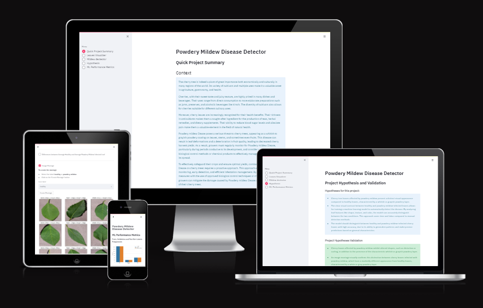
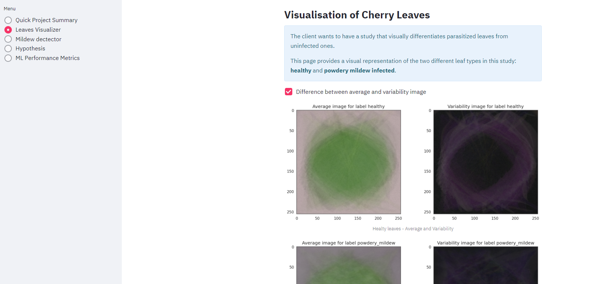
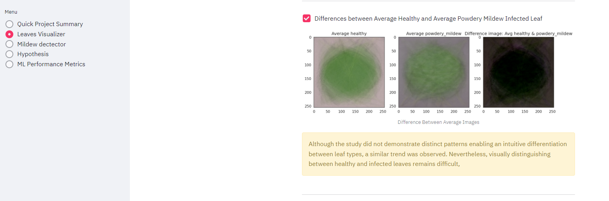

# Mildew Disease Detector

Mildew Disease Detector is an app that can determine whether a cherry leaf is healthy or infected with powdery mildew. The app can predict on new image data whether a given cherry leaf is healthy or infected.

The project aims to create a Predictive Analytics Machine Learning Tool that can quickly and accurately determine whether an uploaded image of a cherry leaf is healthy or infected with Powdery Mildew Disease, which is harmful to plants. The purpose is to assist the client in minimizing losses as a business heavily reliant on cherry tree for revenue.

The app is designed using an ML model based on supervised learning and single-label binary classification. A binary classifier output is used to predict the outcome of data uploaded to the app.

The App live link is: [mildew-disease-detector](https://mildew-disease-detector-0d7a7c28b9a4.herokuapp.com/)

## Dataset Content

- The dataset is sourced from [Kaggle](https://www.kaggle.com/codeinstitute/cherry-leaves). We then created a fictitious user story where predictive analytics can be applied in a real project in the workplace.
- The dataset contains +4 thousand images taken from the client's crop fields. The images show healthy cherry leaves and cherry leaves that have powdery mildew, a fungal disease that affects many plant species. The cherry plantation crop is one of the finest products in their portfolio, and the company is concerned about supplying the market with a compromised quality product.

## Business Requirements

The cherry plantation crop from Farmy & Foods is facing a challenge where their cherry plantations have been presenting powdery mildew. Currently, the process is manual verification if a given cherry tree contains powdery mildew. An employee spends around 30 minutes in each tree, taking a few samples of tree leaves and verifying visually if the leaf tree is healthy or has powdery mildew. If there is powdery mildew, the employee applies a specific compound to kill the fungus. The time spent applying this compound is 1 minute. The company has thousands of cherry trees located on multiple farms across the country. As a result, this manual process is not scalable due to the time spent in the manual process inspection.

To save time in this process, the IT team suggested an ML system that detects instantly, using a leaf tree image, if it is healthy or has powdery mildew. A similar manual process is in place for other crops for detecting pests, and if this initiative is successful, there is a realistic chance to replicate this project for all other crops. The dataset is a collection of cherry leaf images provided by Farmy & Foods, taken from their crops.

- 1 - The client is interested in conducting a study to visually differentiate a healthy cherry leaf from one with powdery mildew.
- 2 - The client is interested in predicting if a cherry leaf is healthy or contains powdery mildew.

## Hypothesis and how to validate?

- Cherry tree leaves affected by powdery mildew present a distinct visual appearance compared to healthy leaves, characterized by a whitish or grayish powdery layer.

- The clear visual contrast between healthy and powdery mildew-infected leaves allows for training a machine learning model to automatically detect the disease. By analyzing leaf features like shape, texture, and color, the model can accurately distinguish between the two conditions. This approach saves time and labor compared to manual detection methods.

- The model should distinguish between healthy and powdery mildew-infected cherry leaves with high accuracy, due to its ability to generalize patterns and make precise predictions based on general characteristics.

## The rationale to map the business requirements to the Data Visualisations and ML tasks

### Business Requierement 1

- Data Visualization:

    * Display the average image and variability for healthy and powdery mildew-infected leaves, along with the difference between them.
    * Create an image montage for each leaf class, enabling visual comparison and recognition of specific patterns within each class.
    * Meet the client's requirements by providing a clear and concise visualization of differences between healthy and powdery mildew-infected leaves, facilitating the detection of different leaves.

### Business Requirement 2

- Classification of Images:

    * Develop a precise prediction tool based on a binary classifier to determine the health of cherry tree leaves in relation to powdery mildew.
    * Incorporate the ability to generate detailed reports on prediction results, facilitating analysis and decision-making for the client.
    * Reduce the need for manual detection of the infection, saving time, human resources, and capital for the company, while increasing revenue through increased productivity and product availability in the market.

## ML Business Case

- Automated Detection of Powdery Mildew on Cherry Leaves

    * Business Objective:

    To develop an automated diagnostic tool based on machine learning for rapidly and accurately detecting powdery mildew on cherry leaves. This aims to reduce the time and resources required for manual detection while enhancing tree health and increasing business productivity.
    
    * Proposed Solution:

    Create a machine learning image classification model that distinguishes between healthy cherry leaves and leaves infected with powdery mildew. By utilizing advanced machine learning techniques, this model will provide precise predictions, enabling rapid detection of powdery mildew.

    * Success Metric:

    Achieve a prediction accuracy of at least 97% on a test dataset, ensuring the reliability and effectiveness of the model for the client.

    * Benefits for the Client:

        - Significant reduction in the time and resources needed for manual powdery mildew detection.
        - Early prevention of powdery mildew spread, maintaining tree health and optimizing crop yield.
        - Improvement in the quality and quantity of cherry production through rapid and accurate powdery mildew detection.
    
    * Implementation Plan:

        1. Data Collection and Preparation: Gather a dataset of images of healthy and powdery mildew cherry leaves.
        2. Model Development: Design and train an image classification machine learning model.
        3. Model Evaluation: Assess model performance on an independent test dataset to ensure reliability.
        4. Integration into an Application: Develop an application allowing employees to upload images and obtain real-time detection results.

## Project Methodologies

 This project was developed using agile methodologies. Used in conjunction with GitHub Issues and Projects, allow us to track project progress in real-time, prioritise features for development.

The CRISP-DM model provides a structured approach to managing data mining projects, guiding us during the key phases such as understanding business needs, exploring and preparing data, developing and evaluating models, and finally deploying results in a commercial context, ensuring a robust and reliable end-to-end process.

## Dashboard Design (Streamlit App User Interface)

### Page 1: Quick Project Summary

* This will be the first page that loads upon using the application. The user will be able to find information about the project context, the problem statement, the business requirements, and the data source, as well as a link to the README file."

    - context

    This section will provide us with general information about cherry trees and the powdery mildew infection. There will also be a link to go to the powdery mildew page and another one to the cherry tree page.

        

    - Problem Statement
    
    This section outlines the problem.

    

    - Business Requirements

    This section outlines the two business requirements.

    - Project Dataset

    this section show the dataset and you have a link to it.

    Link to additional information (Readme file)

    

### Page 2: Leaves Visualizer

- It will answer business requirement 1

    

    * Checkbox 1 - Difference between average and variability image

    

    * Checkbox 2 - Difference between average healthy and average not healthy leaves
    
    
    
    * Checkbox 3 - Image Montage

    
    

### Page 3: Mildew Detector

- It will answer business requirement 2 
    * information. - "The client is interested in predicting whehter a cherry leaf is healthy or is infected with powdery mildew."
    * Link to download a set of healthy and infected leaves for live prediction.
    * User Interface with a file uploader widget. The user should upload leaves images. It will display the image and a prediction statement, indicating if the leaf is healthy or not.
    * Table with image name and prediction results.
    * Download button to download table.

    

    

    
 

### Page 4: Hypothesis 

- In the first section of this page, the user can view the project hypotheses, while in the second section, they can find the validation. This page is purely text-based, so there are no user actions to perform.

    

### Page 5: ML Performance Metrics

- Label Frequencies for Train, Validation and Test Sets
    
    

- Model History - Accuracy and Losses
- Model evaluation result

    

## Bugs
 
 
- Deployment to Heroku
    - Push rejected:

        - failed to compile Python app.
        Heroku error appears to state that the Python version is not available

        To fix this, I logged in to the Heroku command line interface (CLI) and used the following command to set the stack to Heroku-20.
    
        - Compiled slug size: 533.2M is too large (max is 500M). 

        To fix this issue, I added some files to be ignored in the .slugignore file.

 - FileNotFoundError: [Errno 2] No such file or directory: 'inputs/cherry_leaves_dataset/cherry-leaves/test/train'"" pas de file or directory

    - The variable 'label' was used twice for different datasets, which caused the 'no file or directory' error.

    To correct the error, I renamed one variable "label" as "dataset_label

## Deployment

### Heroku

- The App live link is: [mildew-disease-detector](https://mildew-disease-detector-0d7a7c28b9a4.herokuapp.com/)
- Set the runtime.txt Python version to a [Heroku-20](https://devcenter.heroku.com/articles/python-support#supported-runtimes) stack currently supported version.
- The project was deployed to Heroku using the following steps.

1. Log in to Heroku and create an App
2. At the Deploy tab, select GitHub as the deployment method.
3. Select your repository name and click Search. Once it is found, click Connect.
4. Select the branch you want to deploy, then click Deploy Branch.
5. The deployment process should happen smoothly if all deployment files are fully functional. Click the button Open App on the top of the page to access your App.
6. If the slug size is too large, then add large files not required for the app to the .slugignore file.

## Main Data Analysis and Machine Learning Libraries

- Pandas 

Helped to manipulate data to put them into DataFrames.

- Numpy

Provided me with tools to efficiently perform numerical computations using arrays.

- Matplotlib 

 Assisted me in plotting data visualizations.

- Seaborn 

Helped me to create informative statistical visualizations.

- Plotly 

Gave me tools to create interactive and dynamic visualizations.

- Tensorflow 

Provided me with a flexible infrastructure for building, training, and deploying machine learning models.

- Keras 

Allowed me to create and train machine learning models.

- Joblib 

Used for loading and saving files generated in the project.

- Shutil

Used to perform operations on files and directories.

## Technologies Used
 
### Languages

- Python

### Development and Hosting

- Jupyter Notebooks 

The main development source for running and executing the ML pipelines.

- Gitpod

Used as the workspace and development environment for this project.

- Streamlit

UI host for the dashboard.

- Heroku

 Used to deploy the project.

## Credits

- In this section, you need to reference where you got your content, media and from where you got extra help. It is common practice to use code from other repositories and tutorials. However, it is necessary to be very specific about these sources to avoid plagiarism.
- You can break the credits section up into Content and Media, depending on what you have included in your project.

### Content

- Information  for the 'Context' section on the Project Summary page came from Wikipedia,
    * [Powdery Mildew Diease](https://en.wikipedia.org/wiki/Powdery_mildew)
    * [Cherry](https://en.wikipedia.org/wiki/Cherry)

- Code Institute 
    * The Code and design for this project was largely taken from this Malaria Detector walkthrough project. 
    * Mildew Detection was utilised as the base template for this project.
    * Code Institute Streamlit Lessons

### Media

- The UI for the app has been built using [Streamlit](https://streamlit.io/).
- The images used for the dataset were taken from [Kaggle](https://www.kaggle.com/datasets/codeinstitute/cherry-leaves).

## Acknowledgements

- Special thanks to all Code Institute's team ("Teacher", Lecturers and Tutors) that are making me more knowledgeable and are making this happen.

- Huge thank you to the Slack community, its all the members and all the leads and tutors for their help and support.

- Thanks to my mentor Rohit Sharma for guiding me through this project.
